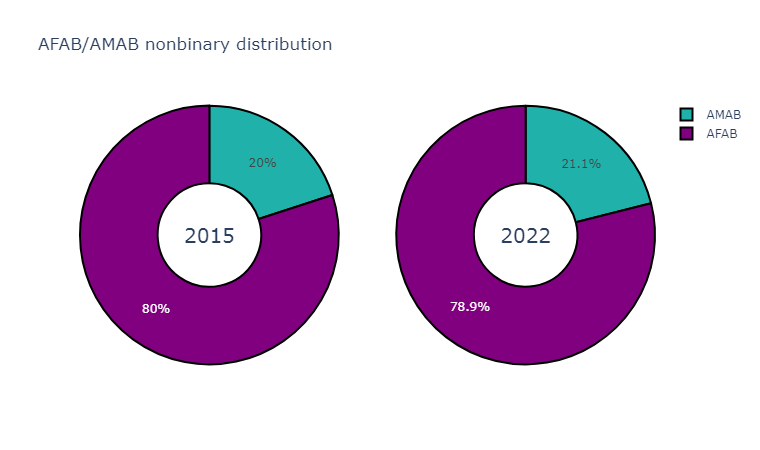

## Visualising and analysing US Trans Survey Data

Learning plotly.py by visualising some percentage data taken from the [2015 and 2022 US Transgender Surveys](https://ustranssurvey.org/).

### Here are the results

The sample group was significantly larger (more than tripling from 27,715 in 2015 to 92,329 in 2022) in the 2022 survey, yet the percentages largely remained similar.

Trans women are still more common than trans men, in spite of lower overall amab numbers, while afab nonbinaries still vastly outnumber amab ones. Crossdressers remain in the vast minority as well.

Trans women's lead over trans men's numbers has increased noticeably.

Overall, we still have an afab majority among the general trans population, although this has slightly improved (likely due to the increase in trans women's/decrease in trans men's percentages).

Supposing that an equal amount of either birthsex *is* (medically speaking) transgender, and in the knowledge that detransitioners who detransition due to legitimately not being trans after all are a dismissibly small minority,

> 2015 USTS Chapter 7 Section C on detransition outlines that only 8% of respondants reported ever having detransitionned, of which only 5% (that is 0.4% of total respondants) reported that their reason for detransition was that "They realized that gender transition was not for them" (while 62% (about 5 out of those 8%) reported that they were currently living in a gender role other than their birth-assigned one).

it seems unlikely that it would be cis women mistakenly labelling themselves as transmascs causing this discrepency. 

Therefore we can instead suppose that amab trans people still feel less able to come out as trans and seek the transition (social and medical) they need than afab ones.

### Nonbinary numbers

Among the nonbinary participants, afab nonbinaries remain in the vast majority, making up roughly 4/5 of the community.

Around the time of the first survey, the reigning theory in the community (source: me, who came out as NB in 2014) for why there were less amab nonbinaries than afab ones was that it was due to lack of nonbinary awareness among amab people. That -given time and awareness raising for nonbinary as a concept in wider society- that number would balance out eventually and we would have a roughly equal amount of amab and afab NBs, the same as trans men and women were roughly balanced.

TURNS OUT THIS WAS INCORRECT. 

Despite an increase in the community's numbers at large due to more awareness and the pandemic forcing people to sit with themselves (= current reigning theories in the community) (source: me, who (as just one example) attended Trans Pride Brighton in 2019 and 2022 and can attest to a *significant* increase in attendance between the two events.) as well as in the sample size of the 2022 survey, the percentage of amab nonbinaries has remained almost stagnant in these 7 years of trans and nb awareness raising.

What change there has been has been a slight increase to all identities other than trans men and crossdressers, who lost percentages, trans men's percentage being hit the hardest with a 4 percent point drop.

I believe this is a sign that:

- <ins>The reason there are less amab nonbinaries is NOT about awareness it is about *gender roles* and *passing*.</ins>

    The only difference between transmascs and transfemmes is their birth-assignment and direction. The sex and gender roles they come from and that they go towards. 

    Supposing that the intrinsic motivations behind using a nonbinary label are similarly balanced as the motivations of binary trans people (like medical gender dysphoria), we need to look at social context to explain such a stark difference.

    What differences are there between the average transmasc and transfemme's experience with gender besides the obvious directional one?

    Ease of passing:

    - A first puberty on estrogen holds back a lot of physical attributes that are (over)developped on testosterone (bones, voice changes, body & facial hair). The only attributes that are (over)developped on E and held back on T are breast tissue and the hip bone. And even with medical transition, the bones (ie height, most face bones, hip width) can't be changed once one has reached adulthood.
    
        - This leads to a lot of adult transmascs facing the issue of being misaged as teen boys even if they do manage to pass as male. (source: have some ND Stevenson comics: like [this one](https://substack.com/@gingerhaze/p-135215962), or [this one](https://substack.com/@gingerhaze/p-138118385))

        - Transfemmes are recognisable as adults even if clocked as not-cis-women, so they have an easier time passing/being recognised as adult women than transmascs have passing/being recognised as adult men.
    
    - Dressing in women's clothes is also less normalised for amab people than dressing in men's clothes is for afab people.

        - Transmascs can be fully gender conforming and still get ma'am-ed like it's nothing while even pre-med transfemmes can get at the very least confused reactions when wearing a dress or similar.

    - This doesn't mean it's impossible for transmascs to pass (or super easy for transfemmes), but it tends to take transmascs longer (= further into medical transition) to start passing securely than it does transfemmes.

        - One of my own main reasons for continuing to present femme and stick to the nonbinary label for as long as I did was that pre-med I couldn't pass whatsoever, even when dressing butch, and I was scared of getting misaged even if I did, so, unable to pass as what I wanted to, I chose the role of woman (being misgendered but taken seriously as an adult) over that of child (not being taken seriously and still at risk of misgendering). It took until well into my medical transition (HRT and several surgeries) as well as complete and utter commitment to masc presentation for me to pass as male at all.

        - I think that trans people who have an easier time passing move on to a binary label faster, while trans people who have a harder time for various reasons take longer and/or maintain a nonbinary label (ex. ND Stevenson still identifies as bigender, despite having come out as Nate he/him boy and pursuing masculinising medical transition). 
        
        &rarr; Nonbinary labels offer a space to openly be a work in progress and fulfill gender needs (like dressing a certain way or accessing physical transition) without having to complete a full binary social transition first.
    
    Gender roles:

    - The female gender roles gives its subjects more leway in return for control over them. Afab people face less pressure to stay women, leading to more trans-identified afab people than trans-identified amab people overall. 

        - If the female gender role doesn't work for them they can easily claim the nonbinary label, because matriarchy doesn't consider you a defector unless you Are A Man. It retains control and influence because it doesn't fully cut people off until they reach patriarchy's gates.

        - Transmascs internalise the deep-seated misandry and manhate the female gender role and feminism promote, putting them under pressure not to be men (cause men are bad obviously 🤦‍♂️), leading to more hesitation around claiming manhood, even when they are literally medically pursuing masculinising transition. This contributes to the inflated nonbinary rate we're seeing among transmascs.

    - The male gender role gives less leway to its subjects, so amab people face more pressure to stay men. 
    
        - Unless it really isn't working for you, you are to stick to the male gender role. Patriarchy, unlike matriarchy, worries greatly about defectors and will do whatever it takes to try and prevent escape. This is why there's still less amab people claiming trans identities than afab people overall despite more trans awareness.

        - Transfemmes, successfully having escaped, are cut off by the male gender role, leaving little merit in the nonbinary label for them. Additionally womanhood is significantly less stigmatised and more desirable than manhood (gets ya empathy, aesthetics, desirability, and, thanks to feminism, also means ya get to keep all the stuff the male gender role has like jobs, bank accounts, pants, etc). This leads to the higher rate of trans women we see despite the overall amab minority, and the incredibly low amab nonbinary rate.

- <ins>Nonbinary awareness isn't helping free gender roles.</ins>

    It offers reprieve from them for people who struggle to fit in for various reasons, but because genderqueer people label themselves as nonbinary, withdrawing their membership from either gender role, rather than claiming it, their gender transgressions do not impact binary gender roles as much as they would if they were committing them under those labels. 

    - Ex. An amab or physically masculine looking person wearing a skirt is highly transgressive if they identify as a man, but expected and highly irrelevant to the male gender role if they identify as nonbinary, leaving the male status quo intact. If this is a medically transmasculine person or an amab person who genuinely does not plan on physically transitionning, that likely means they could reasonably claim the male label if they wanted to, yet they don't.

### Conclusion

I believe that a lot of trans men/strongly trans-male-aligned people are currently still labelling themselves as nonbinary due to a struggle to pass and internalised misandrist stigma preventing them from claiming the male label (source: me, who was doing that for a decade, and finally realised my mistake), and that we are still missing a lot more amab trans people who have yet to come out due to pressure from gender roles.

As gender lib progress happens and people progress in their transitions, I hope to see these numbers balance out, including nonbinary afab numbers finally decreasing, instead joining the trans male block, and amab overall numbers continuing to increase.
