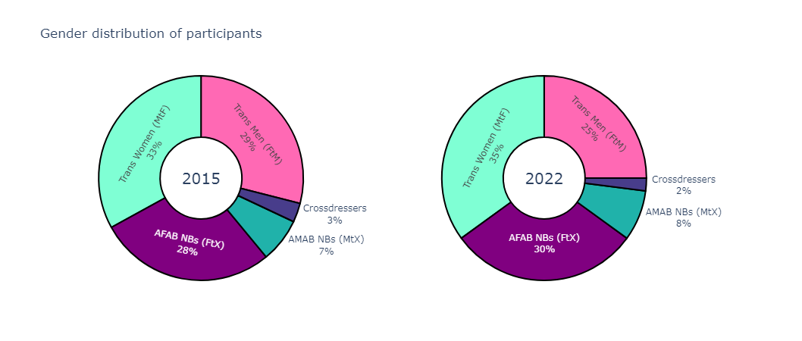
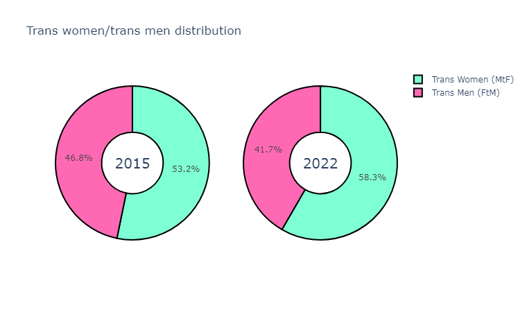
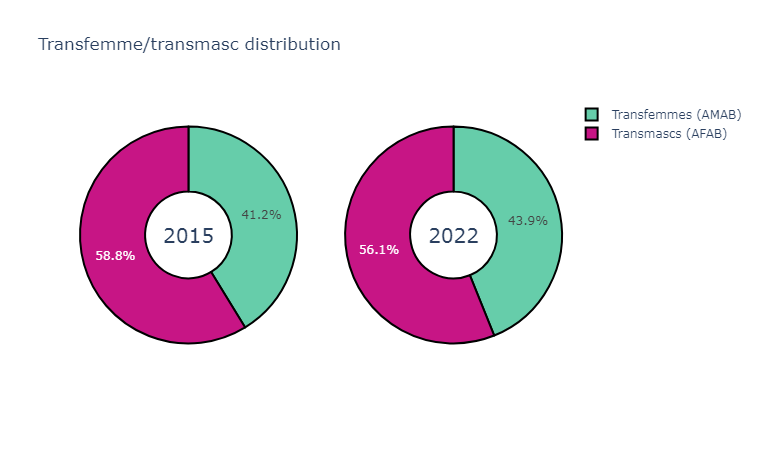
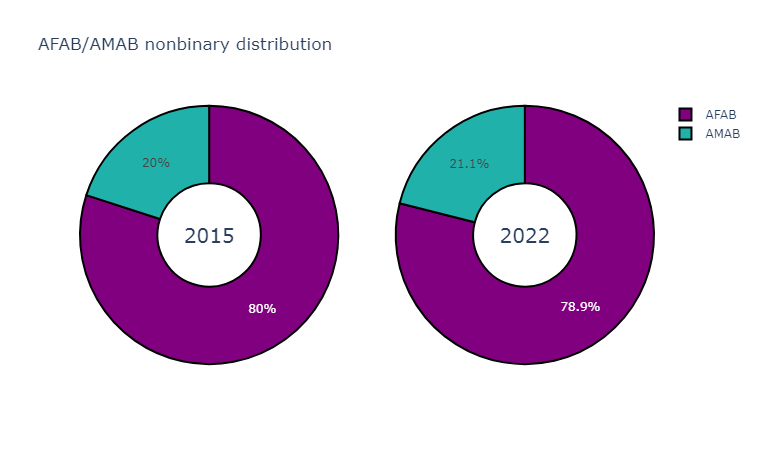
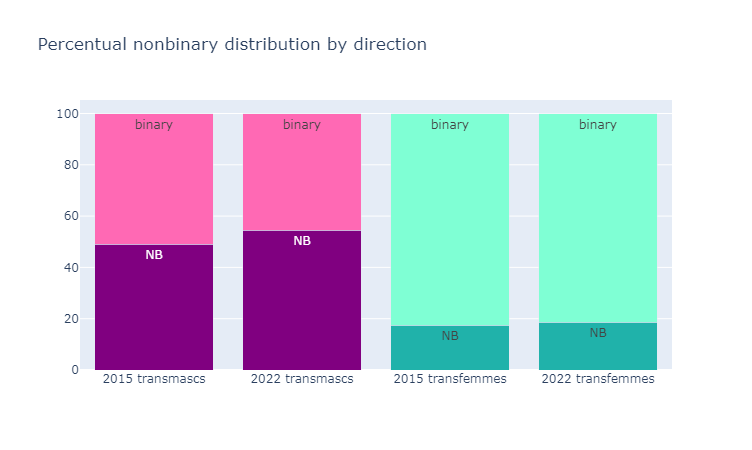
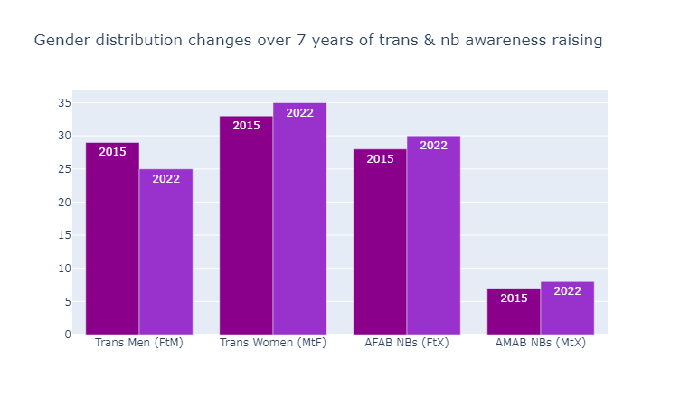

## Visualising and analysing US Trans Survey Data

Learning plotly.py by visualising some percentage data taken from the [2015 and 2022 US Transgender Surveys](https://ustranssurvey.org/).

### Here are the results

The sample group was significantly larger (more than tripling from 27,715 in 2015 to 92,329 in 2022) in the 2022 survey, yet the percentages largely remained similar.

Trans women are still more common than trans men, in spite of lower overall amab numbers, while afab nonbinaries still vastly outnumber amab ones. Crossdressers remain in the vast minority as well.

Trans women's lead over trans men's numbers has increased noticeably.

Overall, we still have an afab majority among the general trans population, although this has slightly improved (likely due to the increase in trans women's/decrease in trans men's percentages).

Supposing that an equal amount of either birthsex *is* (medically speaking) transgender, and in the knowledge that detransitioners who detransition due to legitimately not being trans after all are a dismissibly small minority,

> 2015 USTS Chapter 7 Section C on detransition outlines that only 8% of respondants reported ever having detransitionned, of which only 5% (that is 0.4% of total respondants) reported that their reason for detransition was that "They realized that gender transition was not for them" (while 62% (about 5 out of those 8%) reported that they were currently living in a gender role other than their birth-assigned one).

it seems unlikely that it would be cis women mistakenly labelling themselves as transmascs causing this discrepency. 

Therefore we can instead suppose that amab trans people still feel less able to come out as trans and seek the transition (social and medical) they need than afab ones.

### Nonbinary numbers

Among the nonbinary participants, afab nonbinaries remain in the vast majority, making up roughly 4/5 of the community.

Around the time of the first survey, the reigning theory in the community (source: me, who came out as NB in 2014) for why there were less amab nonbinaries than afab ones was that it was due to lack of nonbinary awareness among amab people. That -given time and awareness raising for nonbinary as a concept in wider society- that number would balance out eventually and we would have a roughly equal amount of amab and afab NBs, the same as trans men and women were roughly balanced.

TURNS OUT THIS WAS INCORRECT. 

Despite an increase in the community's numbers at large due to more awareness and the pandemic forcing people to sit with themselves (= current reigning theories in the community) (source: me, who (as just one example) attended Trans Pride Brighton in 2019 and 2022 and can attest to a *significant* increase in attendance between the two events.) as well as in the sample size of the 2022 survey, the percentage of amab nonbinaries has remained almost stagnant in these 7 years of trans and nb awareness raising.

What change there has been has been a slight increase to all identities other than trans men and crossdressers, who lost percentages, trans men's percentage being hit the hardest with a 4 percent point drop.

I believe this is a sign that:

- <ins>The amab/afab nonbinary split is caused by things other than trans/nonbinary awareness, such as people's ability to pass and gender roles.</ins>

    Supposing that the motivations behind any trans person's journey and need for change are equally balanced between birth assignments, the only difference between transmascs & transfemmes should be the direction of their transition, and the social implications thereof.

    - Ease of passing:

        A first puberty on estrogen and testosterone have different effects. Estrogen holds back the development of pretty much all aspects other than breast tissue and hip size, while testosterone grows everything other than those two things. 
        
        Bones cannot be changed after reaching adulthood, so transmascs tend to struggle with underdevelopped features (compared to cis men) and transfemmes with overgrown ones (compared to cis women), like their height or facial features.

        This leads to a lot of adult transmascs being misaged as teen boys even if they do manage to pass as male. (source: have some ND Stevenson comics: like [this one](https://substack.com/@gingerhaze/p-135215962), or [this one](https://substack.com/@gingerhaze/p-138118385))

        Transfemmes may be demonised and hounded by transphobes for their body size but they are at least recognisable as adults regardless of assumed gender.

        Also amab people dressing in women's clothes are less normalised than the reverse, leading to people being more likely to recognise even a pre-med transfemme as such than an equivalent transmasc.

        &rarr; Therefore transfemmes have an easier time being recognised as adult women than transmascs have being recognised as adult men.

        That is not to say it's impossible for transmascs to pass (or super easy for transfemmes), but it seems to take the average transmasc longer/further into medical transition to start passing securely. (source: me, who it took literally a decade, 5+ years of HRT, several surgeries, and finally a complete and utter commitment to masc presentation to pass as male about 95% of the time (still not always 🙃) as opposed to being misgendered as a cis woman every day of the prior *decade* of my out then-nb-identified life.)
    
        One of my main reasons for presenting femme & sticking to the nb label for as long as I did was that I couldn't pass even if I tried back then, and I was scared of getting misaged even if I did, so, unable to access the option I actually wanted, I chose the role of "woman" over that of "child", to at least be recognised and taken seriously as the grown-ass adult I was.

        I believe people who struggle with passing more take longer to claim a binary label, or are more likely to maintain their nonbinary label. (Ex. ND Stevenson still identifies as bigender despite coming out as Nate he/him boy and pursuing masculinising medical transition.)

        Nonbinary labels offer a space to openly be a work in progress and fulfill gender needs (dressing a certain way, accessing medical transition, etc) without having to complete a full binary social transition or otherwise explain yourself.
    
    - Gender roles:

        Afab people face less pressure to stay women, leading to more trans-identified afab people than trans-identified amab people overall. 

        If the female gender role doesn't work for them they can easily claim the nonbinary label, because matriarchy doesn't consider you a defector unless you Are A Man. It retains control and influence because it doesn't fully cut people off until they reach patriarchy's gates.

        Transmascs internalise the deep-seated misandry and manhate the female gender role and feminism promote, putting pressure on them to not be men (cause men are bad obviously 🤦‍♂️), leading to more hesitation around claiming manhood, even when they are literally medically pursuing masculinising transition. 

        This leads to the inflated afab nonbinary rate and disproportionally low trans male numbers we see.

        Amab people face more pressure to stay men. Unless it really isn't working for you, you are to stick to the male gender role. 
        
        Patriarchy, unlike matriarchy, worries greatly about defectors and will do whatever it takes to try and prevent escape. This is why there's still proportionally less amab people claiming trans identities than afab people despite more trans awareness. 

        (Crossdressing communities like femboys and drag gaining popularity seems to be mitigating this a bit, as they offer a genderqueer space where male identity and femme expression/bodily looks can coexist and be explored without the need to claim an explicitly trans/nb label to do so.)

        Transfemmes, successfully having escaped, are cut off by the male gender role, leaving little merit in the nonbinary label for them unless they have other reasons to claim it (such as struggling to pass, being cis-leaning, having other stuff to work through first, etc). Additionally womanhood is significantly less stigmatised and more desirable than manhood (gets ya empathy, aesthetics, desirability, and, thanks to feminism, lets ya keep all the stuff from the male gender role too, like jobs, bank accounts, *pants*, etc). 
        
        This leads to the higher rate of trans women we see despite the overall amab minority, and the incredibly low amab nonbinary rate.

- <ins>Nonbinary awareness isn't helping free gender roles.</ins>

    It offers reprieve from them for people who struggle to fit in for various reasons, but because genderqueer people label themselves as nonbinary, withdrawing their membership from either gender role, rather than claiming it, their gender transgressions do not impact binary gender roles as much as they would if they were committing them under those labels. 

    - Ex. An amab or physically masculine looking person wearing a skirt is highly transgressive if they identify as a man, but expected and highly irrelevant to the male gender role if they identify as nonbinary, leaving the male status quo intact. 
    
        If this is a medically transmasculine person or an amab person who genuinely does not plan on physically transitionning, that likely means they could reasonably claim the male label if they wanted to, yet they don't.

### Conclusion

I believe that, between misaging, internalised misandry, and the stigma and limitations of the male gender role, a lot of trans men/strongly trans-male-aligned people are currently still labelling themselves as nonbinary instead of claiming the male label, and that we are still missing a lot more amab trans people who have yet to come out due to gender role pressures.

As gender lib progress happens and people progress in their transitions, I hope to see these numbers balance out, including nonbinary afab numbers finally decreasing, instead joining the trans male block, and amab overall numbers continuing to increase.
